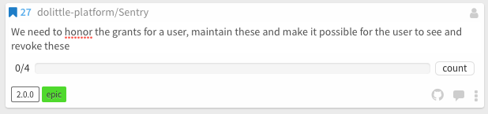
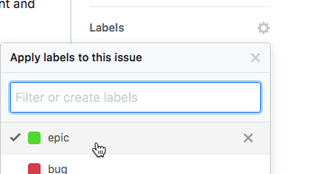
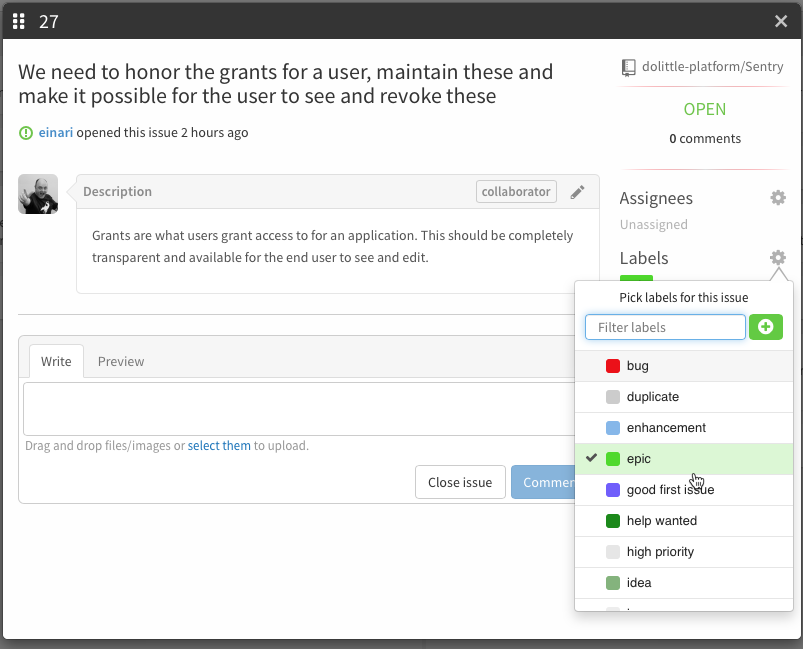

The key words “MUST”, “MUST NOT”, “REQUIRED”, “SHALL”, “SHALL NOT”, “SHOULD”, “SHOULD NOT”,
“RECOMMENDED”, “MAY”, and “OPTIONAL” in this document are to be interpreted as described in
[RFC 2119](https://tools.ietf.org/html/rfc2119).

Dolittle has a default issue template when you create an issue in GitHub.
The template is targetting bugs. For any bugs or problems, please follow the template.

In Dolittle we use [Waffle](https://waffle.io) to manage our internal process of what to prioritize at any given point.
We use its kanban to pull work through and use it in general for planning our milestones.
With this it becomes our living roadmap at the same time.

## Milestones

The top level of our planning sits milestones. We plan based on versions that we want to release.
Often associated with a milestone is a date that is being set.

## Epics

We use epics as a way to describe a problem we're trying to solve. How we write them is super important, it is important
to capture the overall goal and more importantly; [why](https://www.youtube.com/watch?v=u4ZoJKF_VuA). If we don't understand why we're doing it, chances are we wander off into a technical journey with no concrete end.

Everything we do at Dolittle must be well founded in concrete business problems that needs to be solved. The Dolittle platform
is there to make the developers focus on this and empower to actually do this. Therefor we go out of our way to bring back
technical issues to a real business problem that needs solving. This helps focus us.

A couple of examples:

["We need to make sure Sentry is following all recommended guidelines for security - it is a vital piece of the whole Dolittle experience and we don't want security breaches"](https://github.com/dolittle-platform/Sentry/issues/28)

["We need to honor the grants for a user, maintain these and make it possible for the user to see and revoke these"](https://github.com/dolittle-platform/Sentry/issues/27)

In order for Waffle to understand that it is an epic, it has a few rules that can be found [here](https://help.waffle.io/epics/epic-basics). But in general it is fairly simple.

For the most part, just include the text `child of #<issue number>` in the child pointing to the parent to become an epic if the epic exists in the same repository.
It is possible to cross reference from one repository to another, which can be helpful so one does not have to recreate the
same epic many times. You simply have the same text `child of <url to the issue in the other repository>`.

The epic will look like as follows in Waffle:

In addition to this, we label the epics in GitHub to be able to identify these in GitHub:

Also possible to do from Waffle by clicking the number of the issue in the upper left corner:

## Stories

## Tasks

## Committing

When you're committing you can reference issues with hashtag # - and the number of the issue.
This will link the issue and the commit and the commit will show up as a comment on the
issue. This is very useful for transparency and helps on discussing.

## Branching

Creating a branch per issue is a good practice, this isolates the changes you're doing and relates
it to the issue. Name it so that it is clear which issue the branch is for; issue/# - e.g. issue/712.

## Pull requests

Since your branches are named according to the issue it is solving, it will be clear in the pull request.
