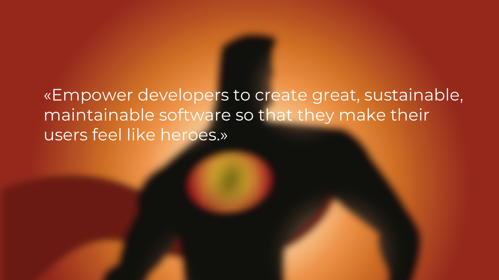

There sits a vision behind Dolittle. Its not necessarily a fixed vision. But the primary objectives are to build a platform that is easy
to use, with high productivity and is easy to maintain. On top of this, the vision has always been and will continue to be to solve
problems for line-of-business applications. It is not aimed to solve arbitrary problems, even though Dolittle might be solving something
outside of the primary focus. This does mean that contributions to Dolittle might not be accepted. Its hard to keep it focused, but
the team behind it will do its best to maintain the focus and not let it diverge from the vision.

The vision of what needs to be implemented shifts over time as one learns and gains experiences from usage of Dolittle. Plus new
techniques and technologies emerges and Dolittle will adapt to these when it makes sense as well. These things, combined with a good
and open dialog with often makes the concrete plans less fixed.
